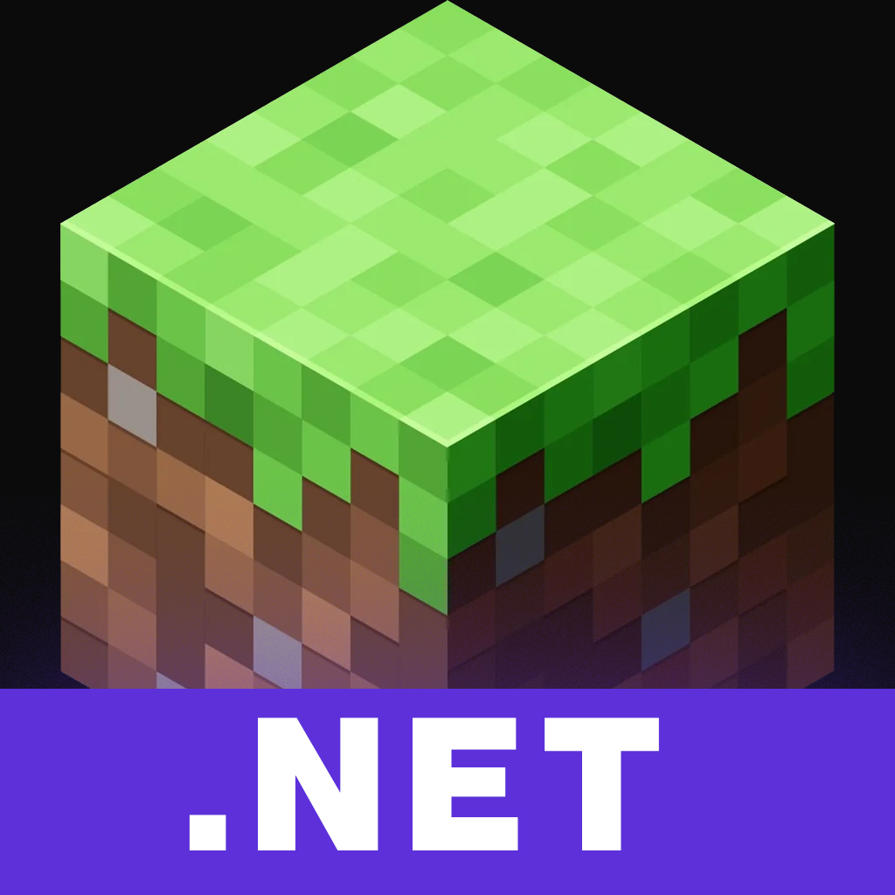

# Minecraft Client Documentation

## Introduction
This documentation provides an overview of the Minecraft Client library and its usage for managing Minecraft instances and starting the Minecraft client.

## Prerequisites
Before using the Minecraft Client library, ensure you have the following:

- .NET Core or .NET 5.0 installed.
- A Microsoft Azure Client ID and Name for user authentication.

## Installation
The Minecraft Client library can be installed using NuGet. Open your project in Visual Studio or any other compatible IDE and run the following command in the Package Manager Console:

```bash
Install-Package Minecraft.NET
```

## Usage

### Creating an Instance Manager
First, create an instance manager to handle all instances for a specified directory:

```csharp
// Create an instance manager to handle instances in the specified directory.
InstanceManager manager = new InstanceManager("./instances");
```

### Creating a Minecraft Instance
To create a Minecraft instance, follow these steps:

```csharp
// Define instance details
InstanceModel instance = new InstanceModel()
{
    Name = "Test",
    Description = "This is a test instance",
    Java = JavaController.GetLocalJVMInstallations("./java").Latest,
    WindowWidth = 1280,
    WindowHeight = 720,
    RAM = new RAMInfo()
    {
        MaximumRamMB = 4096,
        MinimumRamMB = 1024
    }
};

// Create the instance and get the updated instance object.
instance = manager.Create(instance);
```

### Retrieving Instances
To retrieve instances, you can use the following methods:

```csharp
// Get the first instance with the name "Test".
instance = manager.GetFirstInstancesByName("Test");

// Get a list of instances with the name "Test".
InstanceModel[] instances = manager.GetInstancesByName("Test");

// Get the instance based on the unique GUID.
instance = manager.GetInstanceById(instance.Id);
```

### Creating a Minecraft Client
To create a Minecraft client using an instance:

```csharp
// Create a Minecraft client based on the instance with an offline user.
using MinecraftClient client = new MinecraftClient("dev", "./minecraft", instance);

// Set up client information for user authentication.
client.SetClientInfo("Azure Client ID", "Azure Client Name", "Client Version");

// Authenticate the user (prompt the user to login to their Microsoft Account).
await client.AuthenticateUser();

// Downloads the client's resources (libraries, assets, client jar).
await client.DownloadLibraries();
await client.DownloadAssets();
await client.DownloadClient();
```

### Starting the Minecraft Client
To start the Minecraft client and handle its output:

```csharp
// Define an event handler to handle output data received from Minecraft.
DataReceivedEventHandler outputHandler = (s, e) =>
{
    string? data = e.Data;
    if (!string.IsNullOrWhiteSpace(data))
    {
        Console.WriteLine(data); // Write each line from Minecraft to the console.
    }
};

// Start the Minecraft client.
Process process = client.Start();
process.WaitForExit();
```